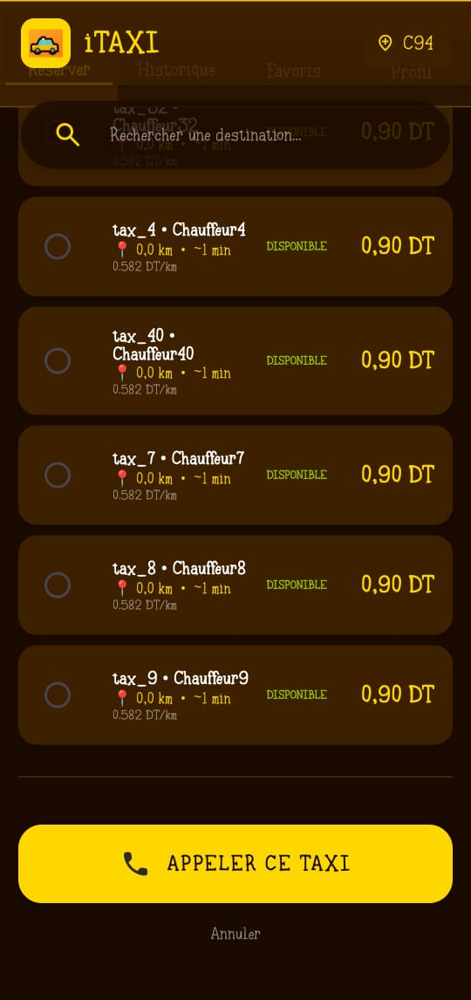
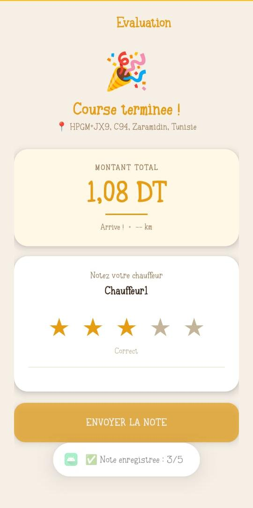

# iTAXI

## Description

Ce projet de fin d'études consiste à développer **iTAXI**, une solution IoT dédiée à la gestion des réservations de taxis.

Son objectif est d'optimiser la mobilité urbaine en réduisant le temps d'attente des clients et en facilitant la réservation et le suivi des taxis.

L'application mobile est accessible aux utilisateurs standards ainsi qu'aux personnes malvoyantes grâce à un assistant vocal permettant de commander un taxi et de suivre leur trajet.

Le système repose sur un boîtier embarqué basé sur le microcontrôleur **ESP32**, intégrant un **GPS NEO-6M**, un **écran LCD 20×4** et deux boutons-poussoirs permettant au chauffeur d'accepter ou de refuser les courses.

L'architecture IoT s'appuie sur une communication bidirectionnelle entre le boîtier embarqué et l'application mobile via **Firebase**, permettant une synchronisation des données en temps réel.

## Technologies utilisées

- Android Studio
- Kotlin
- Arduino IDE
- ESP32
- Firebase
- Altium Designer
- Wi-Fi
- GPS NEO-6M
- LCD 20×4
- Google Maps
- GitHub

## Fonctionnalités principales

### Client standard

- Création de compte et connexion
- Recherche des taxis disponibles en temps réel
- Affichage de la position des taxis
- Affichage du prix estimé
- Réservation d'un taxi
- Suivi du trajet en temps réel
- Gestion des taxis favoris
- Historique des trajets

### Client malvoyant

- Authentification par commande vocale
- Interaction avec l'application par la voix
- Recherche et sélection vocale des taxis
- Guidage vocal
- Indication de la distance en temps réel
- Consultation vocale de l'historique
- Gestion vocale des favoris

### Système IoT du taxi

- Géolocalisation avec GPS NEO-6M
- Communication avec l'ESP32
- Envoi des données vers Firebase
- Affichage des informations sur l'écran LCD
- Mise à jour automatique du statut du taxi
- Synchronisation des données en temps réel

### Chauffeur

- Réception des informations de la course sur l'écran LCD
- Acceptation d'une course avec un bouton
- Refus d'une course avec un bouton
- Communication automatique avec Firebase
- Transmission de la position GPS

# Captures d'écran

## Application mobile

### Application iTAXI

### Connexion malvoyant

### Réservation

### Suivi

### Évaluation

## Système embarqué

### Boîtier embarqué

### Schéma électrique

### Schéma PCB

